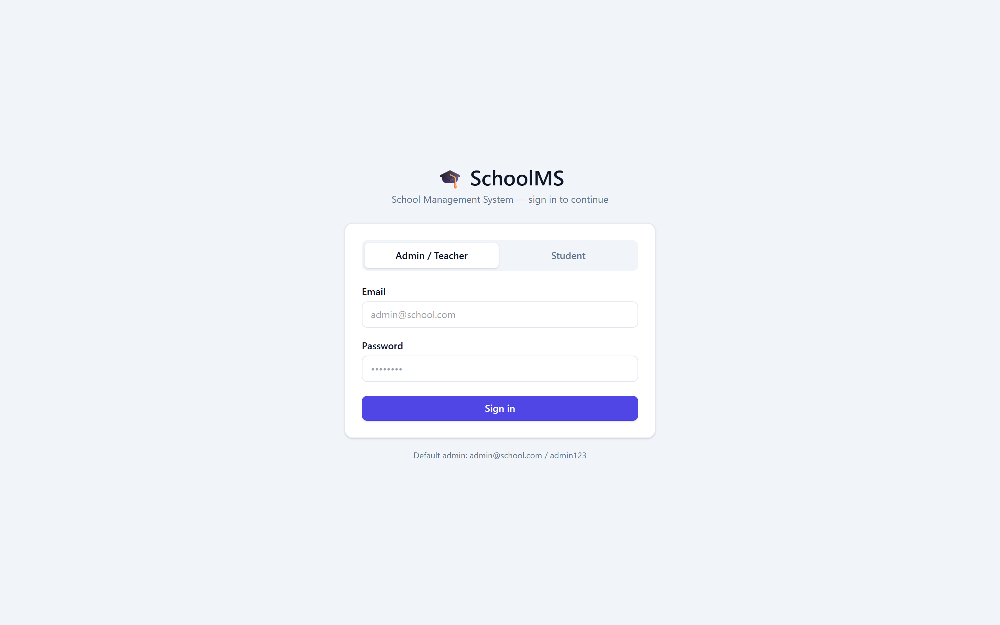
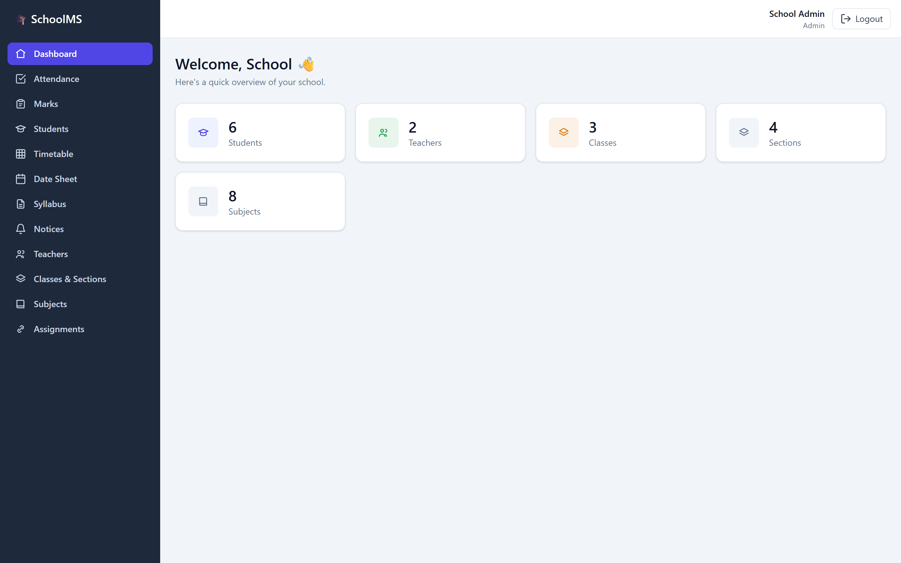
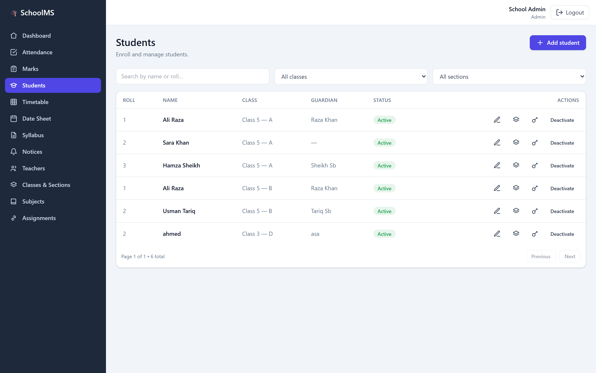
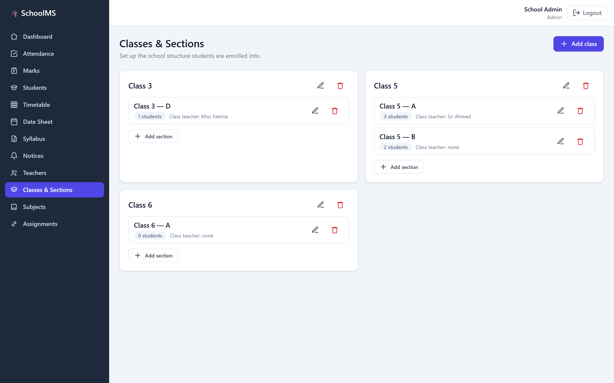
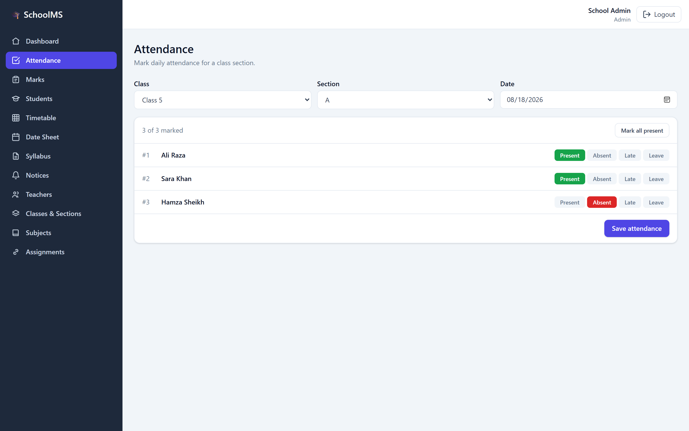
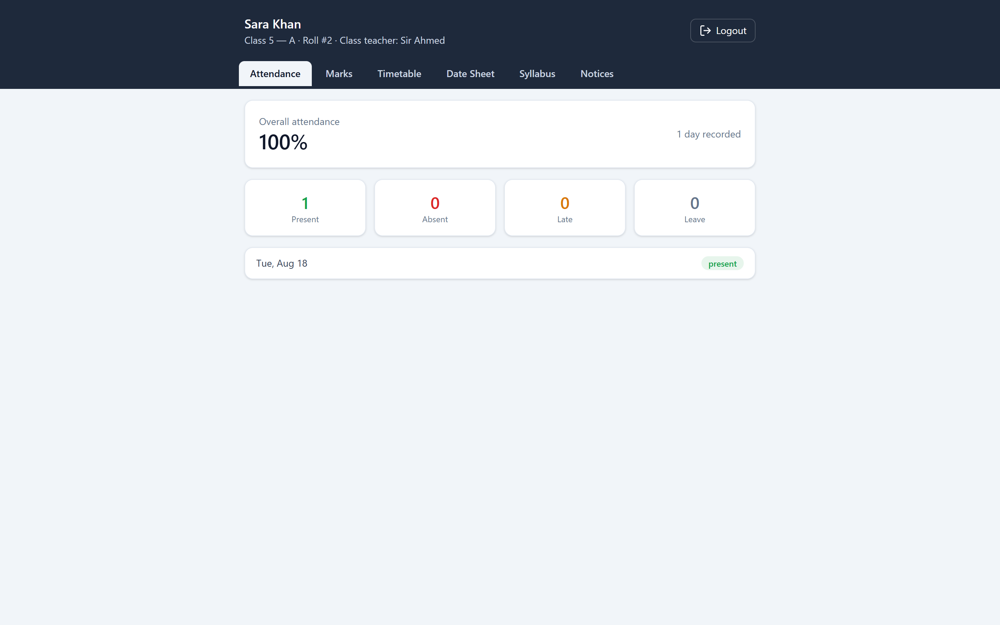

# School Management System

A full-stack web app for running a single school. An admin sets up the school
(classes, sections, subjects, teachers, students), teachers handle the daily
work (attendance, marks, syllabus, date sheet, timetable, notices), and each
student logs in to a read-only portal that shows only their own information.

I built this to practice real full-stack work end to end — auth with roles, a
relational data model with a dozen tables, and a clean React front end on top of
a typed Express API. It runs entirely on free, local tooling (SQLite), so there
is nothing to pay for or configure to try it.

## What it does

Three kinds of users, each with their own access:

- **Admin** — creates teacher and student accounts, sets up classes / sections /
  subjects, assigns students to a section, and assigns teachers to subjects.
- **Teacher** — takes daily attendance, enters marks, and publishes syllabus,
  date sheet, timetable, and notices. Can also add students.
- **Student** — logs in with class + section + roll number and can only *view*
  their attendance (with an overall percentage), marks, class syllabus, date
  sheet, and timetable, plus school notices. No editing.

Other details worth mentioning:

- Roll numbers only need to be unique **within a section** (how real schools
  work), so students log in by picking their class + section, then entering roll
  number and password.
- Passwords are hashed with bcrypt; sessions use a JWT stored in an **httpOnly
  cookie** (so page JavaScript can't read the token).
- Every input is validated on the server with Zod, and deletes are guarded — you
  can't, for example, delete a class that still has students enrolled.

## Screenshots

**Login — admin/teacher and student modes**



**Admin dashboard**



**Managing students**



**Classes & sections**



**Marking attendance**



**Student portal (read-only)**



## Tech stack

**Frontend:** React + TypeScript, Vite, Tailwind CSS, React Router
**Backend:** Node + Express + TypeScript, Prisma ORM
**Database:** SQLite (a single local file — no setup needed)
**Auth:** JWT in httpOnly cookies + bcrypt
**Tooling:** oxlint, Prettier

## Getting started

You'll need [Node.js](https://nodejs.org) (v18+) installed.

### 1. Backend

```bash
cd server
npm install
cp .env.example .env      # then set a JWT_SECRET in .env
npm run db:migrate        # creates the SQLite database
npm run db:seed           # adds an admin + demo data
npm run dev               # starts the API on http://localhost:4000
```

### 2. Frontend

In a second terminal:

```bash
cd client
npm install
npm run dev               # starts the app on http://localhost:5173
```

Open http://localhost:5173 and log in.

### Demo logins (after seeding)

| Role    | How to log in                                        |
| ------- | ---------------------------------------------------- |
| Admin   | `admin@school.com` / `admin123`                      |
| Teacher | `ahmed@school.com` / `teacher123`                    |
| Student | Class 5 → Section A → Roll `2` → `school123`          |

> Please change the admin password after first login on any real deployment.

## Running it offline in a school (no internet, no hosting)

The app can run on one computer and be used by everyone else over the local WiFi —
no deployment or internet needed. On Windows: run `setup.bat` once, then
double-click `start-app.bat` and open the address it prints. In this mode Express
serves the built React app and the API from a single port. Full step-by-step
instructions are in **[HOW-TO-RUN.md](HOW-TO-RUN.md)**.

## Project structure

```
school-management/
├─ client/                 # React + Vite + TypeScript
│  └─ src/
│     ├─ components/       # reusable UI + feature components
│     ├─ pages/            # one file per screen
│     ├─ layouts/          # admin shell (sidebar + topbar)
│     ├─ context/          # auth state
│     ├─ hooks/            # data fetching, debounce
│     ├─ services/         # typed API clients
│     └─ types/
└─ server/                 # Node + Express + TypeScript
   ├─ src/
   │  ├─ routes/           # URL → controller
   │  ├─ controllers/      # request/response handling
   │  ├─ services/         # business logic
   │  ├─ middleware/       # auth, error handling
   │  ├─ validators/       # Zod schemas
   │  ├─ config/  └─ utils/
   └─ prisma/              # schema, migrations, seed
```

## Handy scripts

**Server** (`cd server`)

| Command             | What it does                                  |
| ------------------- | --------------------------------------------- |
| `npm run dev`       | Start the API with auto-reload                |
| `npm run db:seed`   | Seed the admin + demo data                    |
| `npm run db:reset`  | Wipe and rebuild the database (asks first)    |
| `npm run db:studio` | Open Prisma Studio to browse the data         |
| `npm run lint`      | Lint with oxlint                              |
| `npm run format`    | Format with Prettier                          |

**Client** (`cd client`): `npm run dev`, `npm run build`, `npm run lint`,
`npm run format`.

## Data model

Twelve tables: `users`, `students`, `classes`, `sections`, `subjects`,
`teaching_assignments`, `attendance`, `marks`, `syllabus`, `datesheet`,
`timetable`, and `notices`. A student's login lives in `users` (role
`student`); their academic record is a linked `students` row tied to one
section. Everything a student sees is filtered by that section/class.

## Ideas for later

- Bulk-import students from an Excel/CSV file
- Printable report cards from marks
- Parent logins
- "Promote to next class" at year end
- Fees / accounting

## About me

Hi, I'm Ali Sharyar Khan — from Faisalabad, Pakistan. I'm learning full-stack
development the hard way: by building actual products instead of just following
tutorials. Most of my time goes into React and Node.js, and I care more about
writing apps that stay clean and don't break after a week than about collecting
buzzwords.

My main project is [FarmLink.AI](https://github.com/alishehiryarniazi-collab/farmers-app)
— a platform where farmers scan their crops for disease with AI and sell produce
directly to buyers (Next.js on the front, Node/Express + PostgreSQL on the back).
This School Management System is another build in the same spirit — me learning
in public. I know I'm early in the journey, but I show up every day.

Working with: JavaScript, TypeScript, React, Next.js, Node.js, Express, PostgreSQL.

If you're building something interesting, or have advice for someone still
figuring it out, I'd genuinely like to hear from you — alishehiryarniazi@gmail.com

## License

MIT

